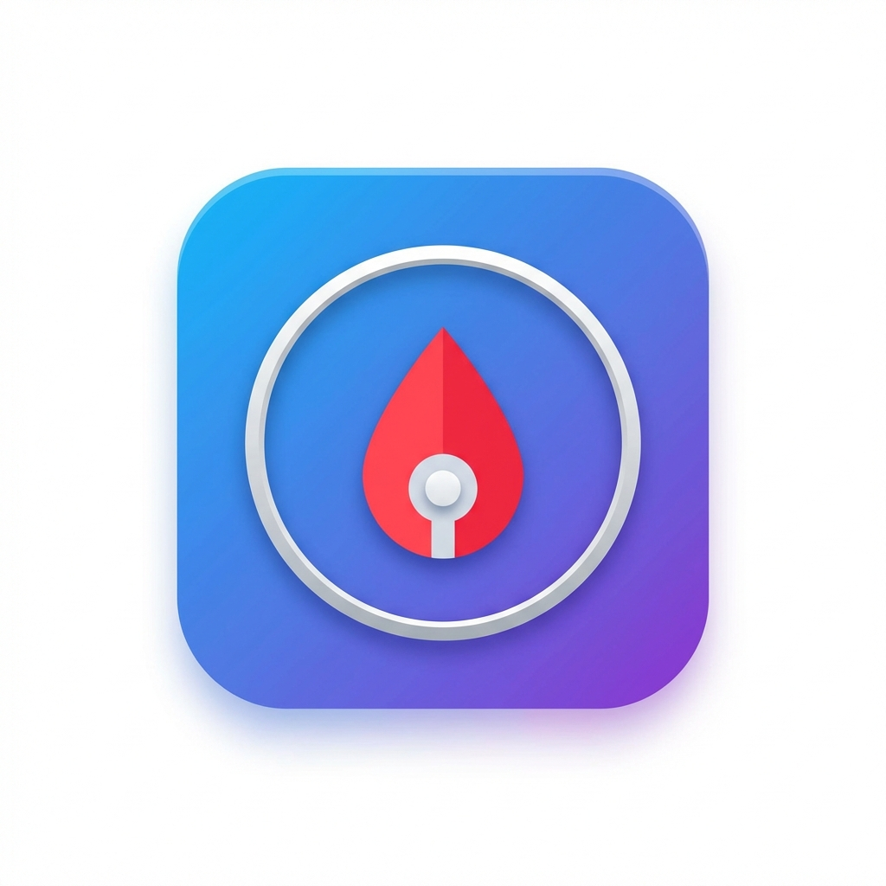

# 🩸 T1D Manager (1형 당뇨 관리 MCP)

<p align="center">
  
</p>

**카카오 MCP Develop Competition (MCP Player 10) 출품작**

1형 당뇨 환자와 보호자를 위한 **AI 에이전트 서버**입니다.
복잡한 설정 없이도 실시간 혈당 관리와 아픈 날(Sick Day) 케어를 받을 수 있습니다.

---

## 📋 PlayMCP 등록 정보

### 🎯 Lite 버전 (경연용 - OAuth 불필요)

| 항목 | 값 |
|------|-----|
| **MCP 이름** | T1D Manager Lite |
| **MCP Endpoint** | `https://t1d-mcp-lite.fly.dev/mcp` |
| **도구 개수** | 3개 |

**MCP 설명 (복사용)**:
> 1형 당뇨 환자와 보호자를 위한 AI 혈당 관리 도우미입니다. 인슐린 용량 계산(ISF/ICR 기반), ISPAD/ADA 임상 가이드라인 기반 아픈 날(Sick Day) 케어, 네이버/다음 하이브리드 검색으로 당뇨 커뮤니티 꿀팁을 제공합니다. OAuth 설정 없이 바로 사용 가능합니다.

---

### 🔐 Full 버전 (Dexcom OAuth 포함)

| 항목 | 값 |
|------|-----|
| **MCP 이름** | T1D Manager |
| **MCP Endpoint** | `https://t1d-mcp.fly.dev/mcp` |
| **도구 개수** | 6개 |

**MCP 설명 (복사용)**:
> 1형 당뇨 환자와 보호자를 위한 AI 혈당 관리 도우미입니다. Dexcom CGM 실시간 연동(OAuth 2.0)으로 현재 혈당과 추세를 확인하고, ISPAD/ADA 임상 가이드라인 기반 아픈 날(Sick Day) 케어 및 인슐린 계산을 지원합니다. 네이버/다음 하이브리드 검색으로 당뇨 커뮤니티 꿀팁도 제공합니다.

---

## 🛠️ 도구 목록

### 핵심 도구 (Lite/Full 공통)

| 도구 | 설명 |
|------|------|
| `calculate_insulin_dosage` | 혈당/탄수화물 기반 인슐린 용량 계산 |
| `search_diabetes_community` | 네이버/다음 하이브리드 검색 (환자 경험담, 꿀팁) |
| `analyze_sick_day_guidelines` | ISPAD/ADA 기반 아픈 날 케어 가이드라인 |

### Dexcom 도구 (Full 버전만)

| 도구 | 설명 |
|------|------|
| `get_dexcom_auth_url` | Dexcom OAuth 인증 URL 생성 |
| `get_cgm_sandbox` | Authorization Code로 CGM 데이터 조회 |
| `get_cgm_with_token` | Access Token으로 CGM 데이터 조회 |

---

## 💬 대화 예시

| 번호 | 예시 |
|------|------|
| 1 | 밥 먹으려는데 탄수화물 60g이야. 인슐린 얼마나 맞아야 해? |
| 2 | 나 열나고 토했어. 어떻게 해야 해? |
| 3 | 저혈당 간식 추천해줘 |
| 4 | Dexcom 로그인 할래 (Full 버전) |

---

## ✨ 핵심 기능

### 1. 🍽️ 스마트 인슐린 계산
- **기능**: 혈당/탄수화물 입력 시 정확한 인슐린 용량과 교육 자료를 **구조화된 JSON**으로 반환합니다.
- 할루시네이션 없는 정확한 계산을 보장합니다.

### 2. 🏥 아픈 날 (Sick Day) 케어
- **기능**: \"나 열 나고 토했어\" → ISPAD/ADA 가이드라인 기반 위험도 분석 및 행동 지침 제공.
- **데이터**: 수분 섭취, 케톤 측정, 응급실 방문 기준 등 안전한 의료 지침을 안내합니다.

### 3. 🔍 하이브리드 커뮤니티 검색
- **기능**: 네이버 블로그(환자 경험담)와 다음 웹(정보)을 동시에 검색하여 실질적인 꿀팁을 제공합니다.

### 4. 📊 Dexcom CGM 실시간 연동 (Full 버전)
- **기능**: Dexcom 공식 Developer API (OAuth 2.0) 지원으로 실시간 혈당 및 추세 확인.

---

## 🛠️ 기술 스택 & 구조
- **Core**: Python 3.12, `mcp` (Model Context Protocol), `FastMCP`
- **Transport**: **Streamable HTTP** (MCP 표준 준수)
- **Integrations**: Dexcom Developer API (OAuth), Naver/Kakao Search
- **Infra**: Docker, Fly.io

```
t1d-mcp/
├── src/
│   ├── server.py          # Streamable HTTP Server Entrypoint
│   ├── main.py            # FastMCP Tool Definitions
│   ├── tools/
│   │   └── dexcom_tools.py  # Dexcom OAuth Tools (조건부 로드)
│   ├── cgm/               # Dexcom Official API Client
│   ├── treatment/         # Sick Day Logic, Insulin Calc
│   └── community/         # Hybrid Search
└── tests/                 # 단위 테스트
```

---

## 🚀 시작하기

### 1. 로컬 실행
```bash
# 의존성 설치 (uv 사용 권장)
uv sync

# 서버 실행 (Streamable HTTP on port 8080)
uv run uvicorn src.server:app --host 0.0.0.0 --port 8080
```

### 2. MCP Inspector로 테스트
```bash
# Lite 버전 (OAuth 없음)
npx @modelcontextprotocol/inspector --transport http --server-url https://t1d-mcp-lite.fly.dev/mcp

# Full 버전 (Dexcom 포함)
npx @modelcontextprotocol/inspector --transport http --server-url https://t1d-mcp.fly.dev/mcp
```

---

## 🔧 환경 설정

### Lite 버전 (기본)
Dexcom 도구 없이 핵심 3개 도구만 활성화됩니다.

```bash
# fly.lite.toml
ENABLE_DEXCOM = "false"
```

### Full 버전
Dexcom OAuth 도구까지 모두 활성화됩니다.

```bash
# fly.toml (기본값)
ENABLE_DEXCOM = "true"  # 또는 미설정
```

---

## 📅 To-Do / Roadmap

### 완료됨
- [x] SSE → Streamable HTTP 마이그레이션
- [x] Sick Day 가이드라인 도구 개선 (JSON 구조화, 의학적 근거 보강)
- [x] Fly.io 배포 완료
- [x] Dexcom Developer Portal 앱 등록 (Sandbox)
- [x] Legacy ID/PW 도구 제거 (심사 기준 준수)
- [x] 도구 최적화 (9개 → 6개)
- [x] Lite/Full 버전 분리 (환경변수 기반)

### 예정
- [ ] Dexcom Production 환경 테스트
- [ ] 영양정보 API 연동 (FoodSafetyKorea 등 외부 API)

---

## ⚠️ 면책 조항 (Medical Disclaimer)
> 본 서비스는 의료 기기가 아니며, 제공되는 정보는 참고용입니다.
> 의학적 결정은 반드시 담당 의료진과 상의해야 합니다.
> 인슐린 용량 계산이나 Sick Day 관리는 환자의 개별 상황에 따라 달라질 수 있습니다.

### 📚 관련 문서
- [DEPLOYMENT.md](./DEPLOYMENT.md): Fly.io 배포 가이드
- [GUIDELINE.md](./GUIDELINE.md): MCP 서버 생성 가이드 및 심사 정책
